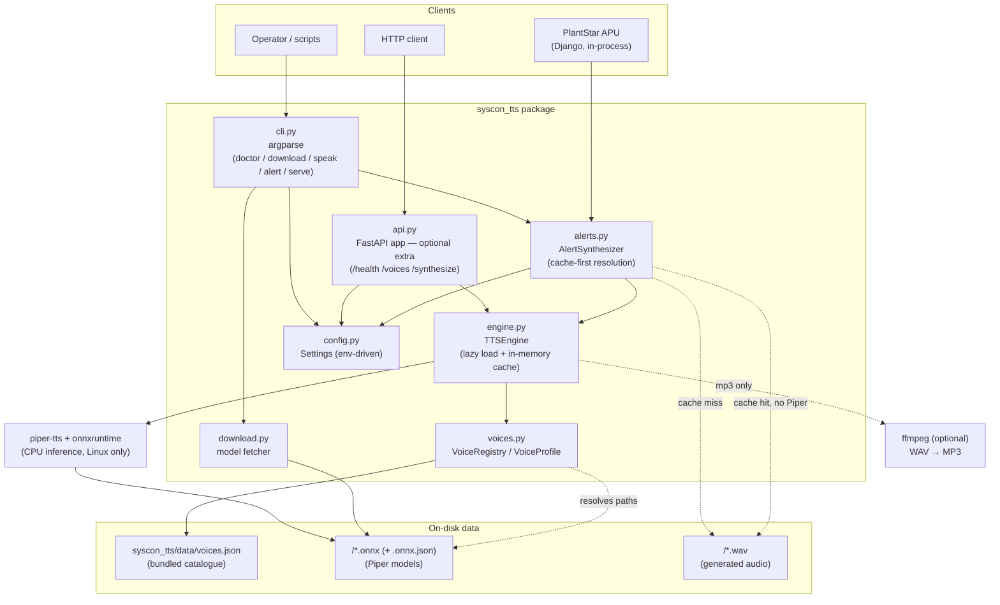

# Syscon TTS — Technical Documentation

Architecture, components, deployment, operations, and interface reference.

- **Audience:** engineers building on, deploying, or operating the package.
- **Scope:** how it is built and how it runs. For a quick start see
  [README.md](../README.md); for step-by-step deployment recipes see
  [DEPLOY.md](../DEPLOY.md).
- **Version:** 1.0.0

---

## 1. Overview

Syscon TTS converts alert text into a spoken-audio file, fully offline, on the
PlantStar APU (Linux x86-64). It wraps the
[Piper](https://github.com/rhasspy/piper) neural TTS engine and exposes it
through three interfaces backed by one shared core:

- a **Python library** — what the APU imports, in-process;
- a **command-line tool** — for provisioning, scripts, and manual use;
- an **optional HTTP server** — installed only with the `[server]` extra.

Multiple voice profiles across several languages are selectable per call. After
a one-time voice-model download during provisioning, the package needs **no
network access** and **no GPU** — inference runs on CPU via ONNX Runtime.

### Design goals and constraints

| Goal | How it's met |
|---|---|
| Runs fully offline | Piper + ONNX models are local; nothing calls out at runtime |
| CPU-only (no GPU on APU) | Piper uses `onnxruntime` CPU inference |
| Installs on developer machines too | Piper is platform-gated; the package degrades to replay-only rather than failing to install |
| Never degrade the APU's Django process | No web deps in the base install; the library is imported directly |
| Multiple selectable voices / languages | JSON voice manifest + per-call voice selection |
| Easy to extend with new voices | Add a manifest entry + download; no code change |
| Predictable footprint | Voices lazy-load and are cached in the synthesizer instance |

---

## 2. Architecture



### Components

| Component | File | Responsibility |
|---|---|---|
| **Config** | `src/syscon_tts/config.py` | Resolve settings from environment variables into a `Settings` dataclass. Single source of paths, host/port, default voice, limits. Nothing is derived from the source tree. |
| **Voice registry** | `src/syscon_tts/voices.py` | Load the manifest into `VoiceProfile` objects; look up voices by id; report whether a voice's model files are on disk. Defines the voice-error types. |
| **Engine** | `src/syscon_tts/engine.py` | `TTSEngine` — lazy-loads Piper models, caches them in memory (thread-safe), renders text to WAV, optionally transcodes to MP3. **The only component that imports Piper.** |
| **Alerts** | `src/syscon_tts/alerts.py` | `AlertSynthesizer` — cache-first resolution of alert text to a WAV on disk. Reproduces Django's `get_valid_filename` so paths match the APU's. The APU's integration point. |
| **Downloader** | `src/syscon_tts/download.py` | Fetch models from HuggingFace with atomic writes. Pure stdlib `urllib`, so it works on every platform. |
| **CLI** | `src/syscon_tts/cli.py` | `argparse` front-end: `doctor`, `download-voices`, `list-voices`, `speak`, `alert`, `serve`. |
| **HTTP API** | `src/syscon_tts/api.py` | Optional FastAPI app exposing `/`, `/health`, `/voices`, `/synthesize`; maps engine/registry errors to status codes. |
| **Voice manifest** | `src/syscon_tts/data/voices.json` | Declarative catalogue mapping stable voice ids to model filenames and download URLs. Ships inside the wheel. The extension point for new voices. |
| **Voice models** | `<voices_dir>/*.onnx` + `*.onnx.json` | Piper weights + phoneme metadata. Downloaded at provisioning; never committed. |

Two structural properties matter:

1. **`api.py`, `cli.py`, and `alerts.py` are adapters.** All synthesis logic
   lives in `engine.py`, all voice knowledge in `voices.py`. Adding a fourth
   interface means writing another adapter, not touching the core.
2. **Only `engine.py` imports Piper, and only inside a function.** That single
   choice is what makes the package importable on Windows and macOS.

---

## 3. Alert lifecycle (the APU path)

`AlertSynthesizer.ensure(text, file_name=..., alerts_dir=...)`:

1. **Derive the name** — `file_name` if supplied, else
   `sanitize_file_name(text)`, which reproduces
   `django.utils.text.get_valid_filename(text)[:50]` byte-for-byte.
2. **Check the cache** — if `<alerts_dir>/<name>.wav` exists, return it
   immediately with `cached=True`. **Piper is never touched.** This is the
   whole cross-platform story: the branch works identically everywhere.
3. **Resolve the voice** — on a miss, the requested voice (or the configured
   default) is looked up in the registry. Unknown id → `UnknownVoiceError`.
4. **Load the model (cached)** — `TTSEngine` checks its in-memory cache. On a
   miss it verifies files exist, imports Piper (→
   `SynthesisUnavailableError` on Windows/macOS), calls `PiperVoice.load(...)`,
   and caches the handle under a lock.
5. **Synthesize** — Piper runs CPU inference into an in-memory WAV container.
   `speed` maps to Piper's `length_scale` as `1.0 / speed`.
6. **Write atomically** — the bytes go to a sibling temp file, are `fsync`'d,
   then `os.replace`'d into position. The APU checks `path.exists()` before
   pushing an audio URL to clients, so a partially written file would be served
   as a truncated alert; a rename makes the file appear only when complete.

Error → status mapping (HTTP API): unknown voice → **404**, model not installed
→ **503**, host can never synthesize → **501**, empty/invalid text or synthesis
failure → **400**, text too long → **413**.

---

## 4. Key design decisions & trade-offs

- **Piper as the engine.** Offline CPU inference, small footprint, a large
  multi-language voice library, permissive license. Trade-off: models are
  language-specific (a German model won't pronounce English well), quality tops
  out below cloud TTS, and the wheels are Linux-only.
- **Platform-gated Piper dependency.** A PEP 508 marker
  (`sys_platform == 'linux' and python_version < '3.12'`) means one
  `pip install syscon-tts` works on every platform. Trade-off: on an
  out-of-range host you get a silently synthesis-less install instead of a hard
  pip failure — which is why `syscon-tts doctor` exists and why DEPLOY.md makes
  it a provisioning gate.
- **Cache-first alerts.** Replay is decoupled from generation, so non-Linux
  machines are useful rather than blocked, and repeat alerts skip inference
  entirely. Trade-off: a stale WAV is served if the text-to-name mapping ever
  collides; the 50-char truncation makes that possible for messages sharing a
  long prefix. Pass an explicit `file_name` to control this.
- **Reimplementing `get_valid_filename` instead of importing Django.** Keeps
  the package Django-free and installable anywhere. Trade-off: the two could
  drift, so `tests/test_alerts.py` pins the exact expected outputs, verified
  against real Django including Unicode and error cases.
- **Lazy load + in-memory cache of voices.** First use pays the model load
  (~1s); later calls reuse the handle. Trade-off: ~50–120 MB per loaded
  `medium` voice. Loading is lock-guarded so concurrent first-hits don't
  double-load.
- **HTTP server as an optional extra.** The APU imports the library, so Django
  never inherits FastAPI/uvicorn. Trade-off: `serve` fails with an install hint
  if the extra is missing.
- **JSON manifest as the extension point.** New voices are data, not code.
  Trade-off: the manifest must stay in sync with disk; `is_installed()`,
  `doctor`, and `/health` surface drift.
- **WAV always, MP3 opt-in via ffmpeg.** WAV needs zero extra dependencies (a
  core requirement for a locked-down APU); MP3's absence produces a clear error
  rather than a hard dependency.
- **Env-var configuration.** One `Settings` object drives library, CLI, and
  systemd identically — no config-file format to maintain.
- **Loopback bind by default.** `127.0.0.1`, not `0.0.0.0`; a plant-floor
  appliance should not expose an unauthenticated service on every interface
  without someone opting in.

### Technology choices

| Concern | Choice | Version |
|---|---|---|
| TTS engine | `piper-tts` (+ `piper-phonemize`, `onnxruntime`) | 1.2.0 |
| Web framework (optional) | FastAPI | ≥0.111,<1.0 |
| ASGI server (optional) | Uvicorn | ≥0.30,<1.0 |
| CLI | Python `argparse` (stdlib) | — |
| Downloads | `urllib` (stdlib) | — |
| Packaging | `pyproject.toml` (setuptools, src layout) | — |
| Tests | pytest (+ FastAPI `TestClient`) | ≥8.2,<9 |

**Platform constraint (important):** `piper-phonemize` publishes prebuilt
wheels only for CPython **3.9–3.11** on **Linux**. The APU (Linux x86-64,
Python 3.11) is fully supported. Windows and macOS get a replay-only install by
design — see [README.md](../README.md#platform-support).

---

## 5. Repository layout

```
syscon_tts/
├── README.md                     Quick start + overview
├── DEPLOY.md                     Provisioning, APU integration, tuning
├── LICENSE                       MIT
├── docs/ARCHITECTURE.md          This document
├── pyproject.toml                Metadata, deps, extras, entry point
├── .github/workflows/
│   ├── ci.yml                    Tests on Linux + Windows + macOS
│   └── release.yml               Tagged PyPI publish (Trusted Publishing)
├── scripts/benchmark.py          Post-deployment performance measurement
├── systemd/syscon-tts.service    systemd unit (hardened)
├── src/syscon_tts/
│   ├── config.py  voices.py  engine.py  alerts.py  download.py
│   ├── api.py  cli.py
│   └── data/voices.json          Bundled voice catalogue
└── tests/
    ├── test_voices.py            Registry behaviour
    ├── test_alerts.py            Cache-first resolution + name parity
    ├── test_config.py            Path resolution + platform gating
    └── test_api.py               API endpoints (Piper mocked)
```

---

## 6. Configuration reference

All configuration is environment variables; every one has a working default.
Read into `Settings` (`config.py`) at load time.

| Variable | Default | Purpose |
|---|---|---|
| `SYSCON_TTS_MANIFEST` | bundled `data/voices.json` | Voice manifest path |
| `SYSCON_TTS_VOICES_DIR` | `<data dir>/voices` | Where `.onnx` models live |
| `SYSCON_TTS_ALERTS_DIR` | `<data dir>/alerts` | Where alert WAVs are written |
| `SYSCON_TTS_HOST` | `127.0.0.1` | API bind host |
| `SYSCON_TTS_PORT` | `5002` | API bind port |
| `SYSCON_TTS_DEFAULT_VOICE` | `en_us_amy` | Voice used when none is requested |
| `SYSCON_TTS_MAX_CHARS` | `20000` | Max text length accepted per request |

`<data dir>` is `/var/lib/syscon-tts` on Linux when writable, else
`~/.local/share/syscon-tts`; `%LOCALAPPDATA%\syscon-tts` on Windows;
`~/Library/Application Support/syscon-tts` on macOS.

---

## 7. Deployment notes

Full recipes in [DEPLOY.md](../DEPLOY.md). In brief:

- **APU / Linux:** `pip install syscon-tts` → `syscon-tts download-voices` →
  `syscon-tts doctor`, with `SYSCON_TTS_VOICES_DIR` and `SYSCON_TTS_ALERTS_DIR`
  pointed at the Django media tree. Rewrite `call_tts()` to call
  `AlertSynthesizer.ensure()`.
- **Optional server:** `pip install 'syscon-tts[server]'` under the provided
  systemd unit.
- **Offline/air-gapped:** `pip download` + `download-voices` on a networked
  machine matching the APU's platform, then copy both across. The package never
  needs the network at runtime.

---

## 8. Operational instructions

### Diagnose

```bash
syscon-tts doctor
```

Reports platform, Python version, resolved paths, ffmpeg, Piper availability,
and installed-voice count. Exits non-zero with an explanation when the host
cannot do what it should. This is the first command to run for any problem.

### Start / stop (HTTP server only)

```bash
sudo systemctl start|stop|restart|status syscon-tts
journalctl -u syscon-tts -f
```

### Health & readiness

```bash
curl -s http://localhost:5002/health
# {"status":"ok","can_synthesize":true,"voices_total":6,"voices_installed":N}
```

`voices_installed` < `voices_total` means some manifest voices have no model
files on disk — those return **503** until downloaded. `can_synthesize: false`
means Piper is absent; only cached audio can be served.

### Add / update a voice

1. Copy the bundled manifest, add an entry (unique `id`; `model`/`config`
   filenames and `model_url`/`config_url` from
   [huggingface.co/rhasspy/piper-voices](https://huggingface.co/rhasspy/piper-voices)).
2. Point `SYSCON_TTS_MANIFEST` at your copy.
3. `syscon-tts download-voices <new_id>`.
4. Confirm with `syscon-tts list-voices` (`installed: yes`).
5. Restart any long-running process so it picks up the manifest.

### Change the CPU/quality tier

Swap a voice's `medium` model for `low` (faster/smaller) or `high`
(slower/better) in the manifest, re-download, restart. See
[DEPLOY.md §6](../DEPLOY.md#6-tuning-for-the-apu-cpu).

### Troubleshooting

| Symptom | Likely cause | Action |
|---|---|---|
| `SynthesisUnavailableError` on Windows/macOS | Working as designed — no Piper | Generate audio on a Linux host; cached WAVs still replay |
| `syscon-tts doctor` says Piper missing on Linux | Python 3.12+, or a partial install | Use Python 3.9–3.11, then `pip install 'syscon-tts[piper]'` |
| `/synthesize` → 503, or `doctor` says `0/6` | Models not on disk | `syscon-tts download-voices`; check `SYSCON_TTS_VOICES_DIR` |
| `/synthesize` → 501 | Host can never synthesize | Expected off-Linux; not retryable |
| `/synthesize` → 404 | Bad voice id | `GET /voices` for valid ids |
| Alert audio never appears | `alerts_dir` mismatch | Confirm it equals `MEDIA_ROOT/public_alert_sounds` |
| Stale audio for edited text | Cache hit on a 50-char-truncated name | Pass an explicit `file_name`, or `ensure(..., force=True)` |
| `serve` says uvicorn missing | Server extra not installed | `pip install 'syscon-tts[server]'` |
| MP3 request fails | `ffmpeg` not installed | Install ffmpeg or request WAV |
| High memory | Many voices cached | ~50–120 MB per loaded `medium` voice; restart to reset |

---

## 9. Library reference

```python
from syscon_tts import AlertSynthesizer, SynthesisUnavailableError
```

### `AlertSynthesizer(settings=None, registry=None, engine=None)`

Build once and keep it — the instance owns the model cache. All three arguments
are injectable, which is how the test suite runs without Piper.

| Method | Description |
|---|---|
| `ensure(text, file_name=None, voice=None, alerts_dir=None, speed=1.0, sentence_silence=0.2, force=False)` | Return an `AlertAudio` for `text`, synthesizing only on a cache miss. |
| `exists(text, alerts_dir=None)` | Whether generated audio is already on disk. |
| `path_for(file_name, alerts_dir=None)` | The path a given name would occupy. |

### `AlertAudio`

Frozen dataclass; implements `__fspath__`, so it can be passed anywhere a path
is accepted.

| Field | Meaning |
|---|---|
| `path` | The WAV on disk |
| `file_name` | Name without extension |
| `cached` | `True` if the file already existed (no synthesis ran) |
| `voice` | Voice used, or `None` on a cache hit |

### Errors

| Exception | Meaning |
|---|---|
| `SynthesisUnavailableError` | Piper unusable here (expected on Windows/macOS). Subclass of `SynthesisError`. |
| `SynthesisError` | Synthesis attempted and failed |
| `UnknownVoiceError` | Voice id not in the manifest |
| `VoiceNotInstalledError` | Voice known, model files absent |
| `InvalidAlertNameError` | Text yields no usable file name |

### Other helpers

`sanitize_file_name(text, max_length=50)`, `piper_available()`,
`load_settings()`, `ensure_alert_wav(text, **kwargs)` (one-shot; builds a
throwaway synthesizer, so avoid it in long-running processes).

---

## 10. CLI reference

Installed as `syscon-tts`. Uses the same config and models as the library.

```
syscon-tts [--version] <command> ...
```

| Command | Purpose | Needs Piper |
|---|---|:--:|
| `doctor` | Report platform, Piper, paths, model status | no |
| `download-voices [ids...] [--force]` | Fetch models (needs internet) | no |
| `list-voices` | Catalogue + install state | no |
| `speak` | Synthesize text to a file | yes |
| `alert` | Cache-first resolution, as the APU does | on miss |
| `serve` | Run the HTTP server (`[server]` extra) | on request |

### `speak`

| Option | Description |
|---|---|
| `text` (positional) | Text to speak |
| `-v, --voice` | Voice id; defaults to the configured default |
| `-o, --output` | **Required.** Output file path |
| `-f, --format` | `wav` or `mp3`; default inferred from `--output` |
| `--text-file` | Read text from a file instead of the positional arg |
| `--speed` | Speed multiplier (default `1.0`) |
| `--sentence-silence` | Seconds of pause between sentences (default `0.2`) |

Text resolution order: `--text-file` → positional → **stdin**, so
`echo "hi" | syscon-tts speak -v en_us_amy -o hi.wav` works.

### `alert`

| Option | Description |
|---|---|
| `text` (positional) | Alert message text |
| `-v, --voice` | Voice id |
| `--file-name` | Override the derived name (no extension) |
| `--alerts-dir` | Override the configured alerts directory |
| `--force` | Regenerate even on a cache hit |

### `serve`

| Option | Description |
|---|---|
| `--host` | Bind host (default `127.0.0.1`) |
| `--port` | Bind port (default `5002`) |
| `--workers` | Uvicorn worker processes (default `1`) |

**Exit codes:** `0` success · `1` error · `2` (`alert` only) audio absent and
this host cannot synthesize.

---

## 11. HTTP API reference

Optional. Base URL `http://<host>:<port>` (default `127.0.0.1:5002`). No
authentication — intended for a trusted local segment. See [§12](#12-performance-resources--security-notes).

### `GET /`
```json
{"service":"Syscon TTS","version":"1.0.0","engine":"piper",
 "default_voice":"en_us_amy","endpoints":["/health","/voices","/synthesize"]}
```

### `GET /health`
```json
{"status":"ok","can_synthesize":true,"voices_total":6,"voices_installed":6}
```

### `GET /voices`
```json
{
  "default": "en_us_amy",
  "voices": [
    {"id":"en_us_amy","name":"Amy — US English, female",
     "language":"en_US","gender":"female","installed":true}
  ]
}
```

### `POST /synthesize`

| Field | Type | Default | Notes |
|---|---|---|---|
| `text` | string | — (required) | Text to speak |
| `voice` | string | server default | Voice id (see `/voices`) |
| `format` | string | `"wav"` | `"wav"` or `"mp3"` (mp3 needs ffmpeg) |
| `speed` | number | `1.0` | Multiplier; `>0` and `≤4.0` |
| `sentence_silence` | number | `0.2` | Seconds between sentences (`0`–`5`) |

**Response:** raw audio bytes. `Content-Type` `audio/wav` or `audio/mpeg`;
`Content-Disposition: attachment; filename="speech.<ext>"`; `X-Voice` header.

**Status codes:** `200` OK · `400` bad input / synthesis error · `404` unknown
voice · `413` text too long · `422` malformed body · `501` host cannot
synthesize · `503` voice not installed.

Interactive OpenAPI docs at `/docs` and `/redoc` when running.

---

## 12. Performance, resources & security notes

**Performance.** Piper `medium` voices synthesize several times faster than
real-time on typical APU-class CPUs; `low` is faster with a modest quality drop.
Latency is dominated by text length and, on first use of a voice, model load.
Benchmark on the actual APU before fixing a quality tier. Cache hits are a
`stat` call — effectively free, and the common case for repeated alerts.

**Resources.** ~60 MB on disk per `medium` model; ~50–120 MB RSS per voice once
loaded. Base process plus one voice fits comfortably in a few hundred MB.

**Concurrency.** Model loading is lock-guarded; synthesis of already-loaded
voices proceeds concurrently. Multiple uvicorn workers each keep their own
cache, so memory scales with workers × loaded voices.

**Security.** The API is unauthenticated and binds `127.0.0.1` by default; it
is designed for a trusted APU segment. If it must be reachable more broadly,
front it with a reverse proxy adding TLS and auth rather than widening the
bind. `max_text_chars` bounds request size. Alert file names are sanitized to
`[-\w.]` before touching the filesystem, so message text cannot traverse
directories. Downloads write to a temp file and rename, so an interrupted fetch
never leaves a truncated model in place. The systemd unit is hardened
(`NoNewPrivileges`, `ProtectSystem=strict`, `PrivateTmp`, `ProtectHome`). No
outbound network calls happen at runtime — only `download-voices` uses the
network.

---

## 13. Testing

```bash
pip install -e ".[dev]"
pytest
```

The full suite runs **without Piper or downloaded models**, on any platform —
synthesis is mocked and the alerts tests inject a fake engine. That is
deliberate: it means a Windows or macOS developer gets the same green suite as
CI, and CI can assert the cross-platform install contract on all three OSes.

| File | Covers |
|---|---|
| `test_voices.py` | Manifest loading, lookup, install detection, bundled-catalogue sanity |
| `test_alerts.py` | Cache hit/miss, force, atomic write, Django name parity |
| `test_config.py` | Path resolution away from the source tree, env overrides, platform gating |
| `test_api.py` | Endpoints and error→status mapping (engine mocked) |

Real audio synthesis is validated on the target as described in
[DEPLOY.md §3](../DEPLOY.md#3-validate).
