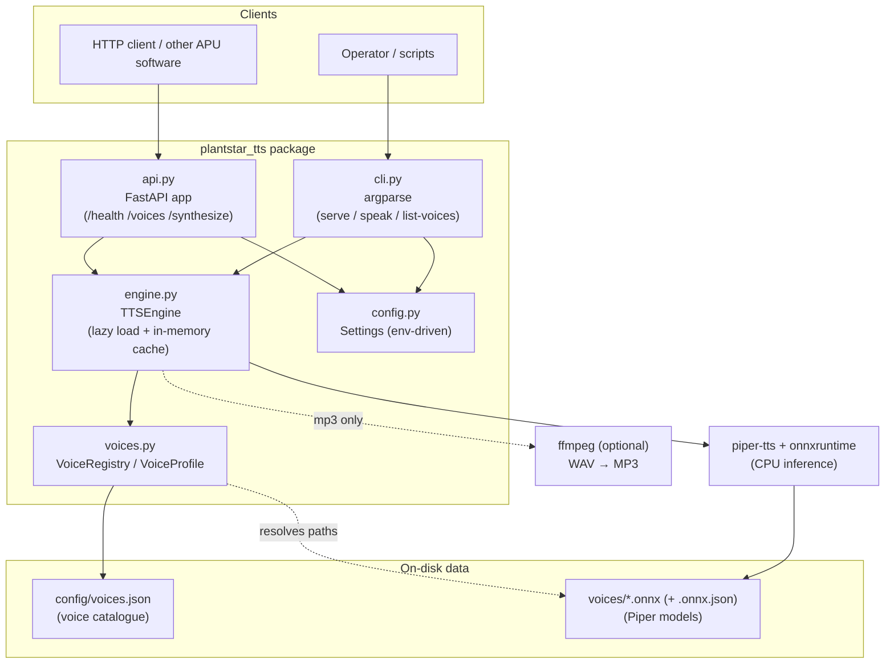

# PlantStar TTS — Technical Documentation

Architecture, components, deployment, operations, and interface reference for
the PlantStar TTS service.

- **Audience:** engineers building on, deploying, or operating the service.
- **Scope:** how the service is built and how it runs. For a quick start see
  [README.md](../README.md); for step-by-step deployment recipes see
  [DEPLOY.md](../DEPLOY.md).
- **Version:** 1.0.0

---

## 1. Overview

PlantStar TTS converts arbitrary text into a spoken-audio file, fully offline,
on the PlantStar APU (Linux x86-64). It wraps the [Piper](https://github.com/rhasspy/piper)
neural TTS engine and exposes it through two interfaces backed by one shared
core:

- an **HTTP REST API** (for other software on/around the APU), and
- a **command-line tool** (for scripts, scheduled jobs, and manual use).

Multiple voice profiles across several languages are selectable at request
time. After a one-time voice-model download during provisioning, the service
needs **no network access** and **no GPU** — inference runs on CPU via
ONNX Runtime.

### Design goals and constraints

| Goal | How it's met |
|------|--------------|
| Runs fully offline | Piper + ONNX models are local; nothing calls out at runtime |
| CPU-only (no GPU on APU) | Piper uses `onnxruntime` CPU inference |
| Multiple selectable voices / languages | JSON voice manifest + per-request voice selection |
| Two interfaces (API + CLI) | Both are thin adapters over a shared engine core |
| Easy to extend with new voices | Add a manifest entry + download; no code change |
| Predictable footprint | Voices lazy-load and are cached; models mounted, not baked into images |

---

## 2. Architecture



### Components

| Component | File | Responsibility |
|-----------|------|----------------|
| **Config** | `src/plantstar_tts/config.py` | Resolve runtime settings from environment variables into a `Settings` dataclass. Single source of paths, host/port, default voice, limits. |
| **Voice registry** | `src/plantstar_tts/voices.py` | Load the voice manifest into `VoiceProfile` objects; look up voices by id; report whether a voice's model files are present on disk. Defines the voice-error types. |
| **Engine** | `src/plantstar_tts/engine.py` | `TTSEngine` — lazy-loads Piper voice models, caches them in memory (thread-safe), renders text to WAV, and optionally transcodes to MP3. The only component that imports Piper. |
| **HTTP API** | `src/plantstar_tts/api.py` | FastAPI app exposing `/`, `/health`, `/voices`, `/synthesize`; validates input with Pydantic; maps engine/registry errors to HTTP status codes. |
| **CLI** | `src/plantstar_tts/cli.py` | `argparse` front-end: `serve`, `speak`, `list-voices`. Shares the same engine/registry as the API. |
| **Voice manifest** | `config/voices.json` | Declarative catalogue mapping stable voice ids to model filenames and download URLs. The extension point for new voices/languages. |
| **Voice models** | `voices/*.onnx` + `*.onnx.json` | Piper model weights + phoneme/config metadata. Downloaded via `scripts/download_voices.sh`; git-ignored. |

The key structural property: **`api.py` and `cli.py` are thin adapters**; all
synthesis logic lives in `engine.py`, and all voice knowledge lives in
`voices.py`. Adding a third interface (e.g. a gRPC endpoint) would mean writing
another adapter, not touching the core.

---

## 3. Request lifecycle (data flow)

A `POST /synthesize` (the CLI `speak` path is identical below the adapter):

1. **Validate** — FastAPI/Pydantic parse the body into a `SynthesizeRequest`
   (`text`, `voice`, `format`, `speed`, `sentence_silence`). The API also
   enforces `max_text_chars`.
2. **Resolve voice** — the request voice id (or the server default) is looked up
   in the `VoiceRegistry`. Unknown id → error.
3. **Load model (cached)** — `TTSEngine` checks its in-memory cache. On a miss,
   it verifies the model files exist on disk, then calls
   `PiperVoice.load(...)` and caches the handle under a lock. Subsequent
   requests for that voice skip the load.
4. **Synthesize** — Piper runs CPU inference and writes PCM frames into a WAV
   container in memory. `speed` maps to Piper's `length_scale` as
   `length_scale = 1.0 / speed`; `sentence_silence` inserts pauses between
   sentences.
5. **Transcode (optional)** — for `format=mp3`, the WAV bytes are piped through
   `ffmpeg`. WAV requests skip this entirely.
6. **Respond** — the audio bytes are returned with the correct media type
   (`audio/wav` or `audio/mpeg`), a `Content-Disposition` attachment filename,
   and an `X-Voice` header. The CLI writes the bytes to `--output` instead.

Error → status mapping (API): unknown voice → **404**, voice known but model not
installed → **503**, empty/invalid text or synthesis failure → **400**, text too
long → **413**.

---

## 4. Key design decisions & trade-offs

- **Piper as the engine.** Chosen for offline CPU inference, small footprint, a
  large multi-language voice library, and a permissive license. Trade-off: voice
  models are language-specific (a German model won't pronounce English well) and
  quality tops out below cloud TTS.
- **Lazy load + in-memory cache of voices.** First use of a voice pays the model
  load cost (~a second); every later request reuses the loaded handle. Trade-off:
  memory grows ~50–120 MB per loaded `medium` voice. Loading is guarded by a lock
  so concurrent first-hits don't double-load.
- **JSON manifest as the extension point.** New voices/languages are data, not
  code. Trade-off: the manifest must stay in sync with the files on disk;
  `is_installed()` and `/health` surface drift.
- **Models mounted, not baked into the Docker image.** Keeps the image small and
  lets voices be updated without rebuilding. Trade-off: the `voices/` volume must
  be provisioned separately (covered in DEPLOY.md).
- **WAV always, MP3 opt-in via ffmpeg.** WAV needs zero extra dependencies (core
  requirement for a locked-down APU); MP3 is available only when `ffmpeg` is
  present, and its absence produces a clear error rather than a hard dependency.
- **Env-var configuration.** One `Settings` object drives CLI, systemd, and
  Docker identically — no config-file format to maintain.

### Technology choices

| Concern | Choice | Version |
|---------|--------|---------|
| TTS engine | `piper-tts` (+ `piper-phonemize`, `onnxruntime`) | 1.2.0 |
| Web framework | FastAPI | 0.111.0 |
| ASGI server | Uvicorn | 0.30.1 |
| CLI | Python `argparse` (stdlib) | — |
| Packaging | `pyproject.toml` (setuptools, src layout) | — |
| Tests | pytest + FastAPI `TestClient` | 8.2.0 |

**Platform constraint (important):** `piper-phonemize` publishes prebuilt wheels
only for CPython **3.9–3.11**, on **Linux x86-64 / aarch64** and **macOS x86-64**.
There is **no macOS arm64 wheel**. The APU (Linux x86-64) is fully supported; on
Apple-Silicon Macs use Docker. See [DEPLOY.md §2](../DEPLOY.md#2a-bare-metal-linux-3911).

---

## 5. Repository layout

```
plantstar-tts/
├── README.md                     Quick start + overview
├── DEPLOY.md                     Deployment & validation recipes
├── docs/ARCHITECTURE.md          This document
├── pyproject.toml                Package metadata + console_scripts entry point
├── requirements.txt              Pinned runtime deps
├── requirements-dev.txt          + test deps
├── Dockerfile                    Python 3.11-slim image (ffmpeg included)
├── config/voices.json            Voice catalogue (the extension point)
├── scripts/
│   ├── install.sh                venv + deps + voice download (bare metal)
│   └── download_voices.sh        Fetch models from HuggingFace into voices/
├── systemd/plantstar-tts.service systemd unit (hardened)
├── src/plantstar_tts/
│   ├── config.py  voices.py  engine.py  api.py  cli.py
└── tests/
    ├── test_voices.py            Registry behaviour
    └── test_api.py               API endpoints (Piper mocked)
```

---

## 6. Configuration reference

All configuration is environment variables; defaults make the repo runnable
as-is. Read once at startup into `Settings` (`config.py`).

| Variable | Default | Purpose |
|----------|---------|---------|
| `PLANTSTAR_TTS_HOME` | repo root | Base dir for resolving config/voices |
| `PLANTSTAR_TTS_MANIFEST` | `config/voices.json` | Voice manifest path |
| `PLANTSTAR_TTS_VOICES_DIR` | `voices/` | Where `.onnx` models live |
| `PLANTSTAR_TTS_HOST` | `0.0.0.0` | API bind host |
| `PLANTSTAR_TTS_PORT` | `5002` | API bind port |
| `PLANTSTAR_TTS_DEFAULT_VOICE` | `en_us_amy` | Voice used when none is requested |
| `PLANTSTAR_TTS_MAX_CHARS` | `20000` | Max text length accepted per request |

---

## 7. Deployment notes

Full recipes (bare metal, Docker, systemd, air-gapped, CPU tuning) are in
[DEPLOY.md](../DEPLOY.md). In brief:

- **Bare metal (APU / Linux, Python 3.9–3.11):** `scripts/install.sh` →
  `plantstar-tts serve`, or run under the provided systemd unit.
- **Docker (any host, or Python ≠ 3.9–3.11):** `download_voices.sh` →
  `docker build` → `docker run -v "$PWD/voices:/app/voices" -p 5002:5002`.
- **Offline/air-gapped:** download models (and optionally pip wheels or a saved
  image) on a networked machine and copy them onto the APU. The service itself
  never needs the network at runtime.

**Validated 2026-07-14:** image build, `piper-tts`/`piper-phonemize` install
from Linux wheels, server startup, WAV + MP3 synthesis, and all six bundled
voices, end-to-end in a Linux container.

---

## 8. Operational instructions

### Start / stop

```bash
# systemd (bare metal)
sudo systemctl start|stop|restart|status plantstar-tts
journalctl -u plantstar-tts -f            # logs

# Docker
docker start|stop|restart plantstar-tts
docker logs -f plantstar-tts              # logs
```

### Health & readiness

```bash
curl -s http://localhost:5002/health
# {"status":"ok","voices_total":6,"voices_installed":N}
```

`voices_installed` < `voices_total` means some manifest voices have no model
files on disk — those voices will return **503** until downloaded. This is the
primary signal to watch after deployment or a manifest change.

### Add / update a voice

1. Add an entry to `config/voices.json` (unique `id`; `model`/`config` filenames
   and `model_url`/`config_url` from
   [huggingface.co/rhasspy/piper-voices](https://huggingface.co/rhasspy/piper-voices)).
2. `scripts/download_voices.sh <new_id>`.
3. Restart the service (Docker: `docker restart`; systemd: `systemctl restart`).
4. Confirm with `plantstar-tts list-voices` or `GET /voices` (`installed: true`).

### Change the CPU/quality tier

Swap a voice's `medium` model for `low` (faster/smaller) or `high` (slower/better)
in the manifest, re-download, and restart. See
[DEPLOY.md §6](../DEPLOY.md#6-tuning-for-the-apu-cpu).

### Troubleshooting

| Symptom | Likely cause | Action |
|---------|--------------|--------|
| `/synthesize` → 503 | Voice model not on disk | Run `download_voices.sh`; check `PLANTSTAR_TTS_VOICES_DIR` / the Docker `-v` mount |
| `/synthesize` → 404 | Bad voice id | `GET /voices` for valid ids |
| `/synthesize` → 400 "empty text" | Blank input | Send non-empty `text` |
| MP3 request fails | `ffmpeg` not installed | Install ffmpeg or request WAV |
| Install fails: "No matching distribution … piper-phonemize" | Wrong Python/platform | Use Python 3.9–3.11 on Linux x86-64, or use Docker |
| High memory | Many voices loaded/cached | Expect ~50–120 MB per loaded `medium` voice; restart to reset |

---

## 9. API reference

Base URL: `http://<host>:<port>` (default port `5002`). No authentication —
the service is intended for a trusted local/APU network. See
[§11](#11-security-notes).

### `GET /`
Service metadata.
```json
{"service":"PlantStar TTS","version":"1.0.0","engine":"piper",
 "default_voice":"en_us_amy","endpoints":["/health","/voices","/synthesize"]}
```

### `GET /health`
Liveness + how many voices are installed.
```json
{"status":"ok","voices_total":6,"voices_installed":6}
```

### `GET /voices`
List voice profiles and their install state.
```json
{
  "default": "en_us_amy",
  "voices": [
    {"id":"en_us_amy","name":"Amy — US English, female",
     "language":"en_US","gender":"female","installed":true}
  ]
}
```

### `POST /synthesize`
Render text to an audio file.

**Request body (JSON):**

| Field | Type | Default | Notes |
|-------|------|---------|-------|
| `text` | string | — (required) | Text to speak. |
| `voice` | string | server default | Voice id (see `/voices`). |
| `format` | string | `"wav"` | `"wav"` or `"mp3"` (mp3 needs ffmpeg). |
| `speed` | number | `1.0` | Multiplier; `>0` and `≤4.0`. `2.0` = twice as fast. |
| `sentence_silence` | number | `0.2` | Seconds of pause between sentences (`0`–`5`). |

**Response:** raw audio bytes.
- `Content-Type`: `audio/wav` or `audio/mpeg`
- `Content-Disposition`: `attachment; filename="speech.<ext>"`
- `X-Voice`: the voice id used

**Status codes:** `200` OK · `400` bad input / synthesis error · `404` unknown
voice · `413` text too long · `503` voice not installed · `422` malformed body
(FastAPI validation).

**Example:**
```bash
curl -s -X POST http://localhost:5002/synthesize \
  -H 'Content-Type: application/json' \
  -d '{"text":"Machine four cycle complete.","voice":"en_us_ryan","format":"wav"}' \
  -o alert.wav
```

Interactive OpenAPI docs are served at `/docs` (Swagger UI) and `/redoc` when
the server is running.

---

## 10. CLI reference

Installed as `plantstar-tts` (console script from `pyproject.toml`). Uses the
same config and voice models as the API.

```
plantstar-tts [--version] <command> ...
```

### `list-voices`
Print all voice profiles, their language/gender, and whether each is installed.
```bash
plantstar-tts list-voices
```

### `speak`
Synthesize text to an audio file.

| Option | Description |
|--------|-------------|
| `text` (positional) | Text to speak. |
| `-v, --voice` | Voice id. Defaults to the server default voice. |
| `-o, --output` | **Required.** Output file path. |
| `-f, --format` | `wav` or `mp3`. Default inferred from the `--output` extension. |
| `--text-file` | Read text from a file instead of the positional arg. |
| `--speed` | Speed multiplier (default `1.0`). |
| `--sentence-silence` | Seconds of pause between sentences (default `0.2`). |

Text resolution order: `--text-file` → positional `text` → **stdin** (so you can
pipe: `echo "hi" | plantstar-tts speak -v en_us_amy -o hi.wav`).

```bash
plantstar-tts speak -v en_us_amy -o hello.wav "Hello from PlantStar"
plantstar-tts speak -v de_de_thorsten -f mp3 -o ansage.mp3 --text-file notice.txt
```

### `serve`
Start the HTTP API server.

| Option | Description |
|--------|-------------|
| `--host` | Bind host (default from config, `0.0.0.0`). |
| `--port` | Bind port (default from config, `5002`). |
| `--workers` | Uvicorn worker processes (default `1`). |

```bash
plantstar-tts serve --port 5002
```

Exit codes: `0` success; `1` on voice/synthesis errors (message on stderr).

---

## 11. Performance, resources & security notes

**Performance.** Piper `medium` voices synthesize several times faster than
real-time on typical APU-class CPUs; `low` is faster with a modest quality drop.
Latency is dominated by text length and (on first use of a voice) model load.
Benchmark on the actual APU before fixing a quality tier.

**Resources.** ~60 MB on disk per `medium` model; ~50–120 MB RSS per voice once
loaded (voices load on first use and stay cached). Base process + one voice fits
comfortably in a few hundred MB.

**Concurrency.** Model loading is lock-guarded; synthesis of already-loaded
voices can proceed concurrently. For higher throughput, run multiple Uvicorn
workers (`serve --workers N`) — note each worker has its own voice cache, so
memory scales with workers × loaded voices.

**Security.** The API is unauthenticated and binds `0.0.0.0` by default; it is
designed for a trusted APU/LAN segment. If it must be reachable more broadly,
front it with a reverse proxy that adds TLS and auth, or bind it to `127.0.0.1`
and colocate callers. `max_text_chars` bounds request size. The systemd unit is
hardened (`NoNewPrivileges`, `ProtectSystem=strict`, `PrivateTmp`,
`ProtectHome`). The service performs no outbound network calls at runtime.

---

## 12. Testing

```bash
pip install -r requirements-dev.txt && pip install -e .
pytest
```

`tests/test_voices.py` covers the registry (manifest loading, lookup, install
detection); `tests/test_api.py` covers the endpoints with a **mocked engine**, so
the suite runs without Piper or downloaded models. Real audio synthesis is
validated on the target (or a Linux container) as described in
[DEPLOY.md §3](../DEPLOY.md#3-validate-the-deployment).
