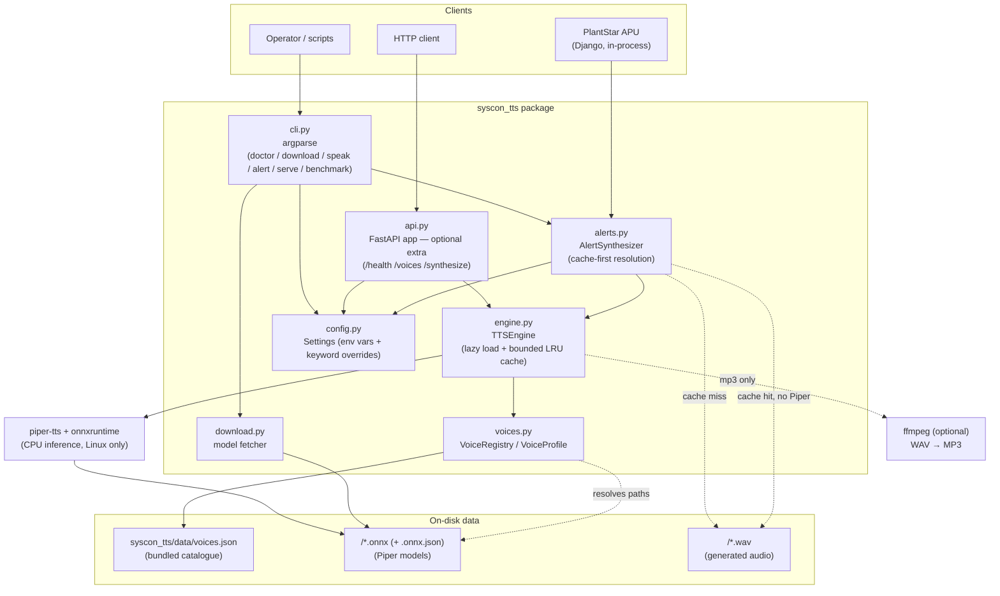

# Syscon TTS — Technical Documentation

Architecture, components, deployment, operations, and interface reference.

- **Audience:** engineers building on, deploying, or operating the package.
- **Scope:** how it is built and how it runs. For a quick start see
  [README.md](../README.md); for step-by-step deployment recipes see
  [DEPLOY.md](../DEPLOY.md).
- **Version:** 0.1.0

---

## 1. Overview

Syscon TTS converts alert text into a spoken-audio file, fully offline, on the
PlantStar APU (Linux x86-64). It wraps the
[Piper](https://github.com/rhasspy/piper) neural TTS engine and exposes it
through three interfaces backed by one shared core:

- a **Python library** — what the APU imports, in-process;
- a **command-line tool** — for provisioning, scripts, and manual use;
- an **optional HTTP server** — installed only with the `[server]` extra.

Multiple voice profiles across several languages are selectable per call. After
a one-time voice-model download during provisioning, the package needs **no
network access** and **no GPU** — inference runs on CPU via ONNX Runtime.

### Design goals and constraints

| Goal | How it's met |
|---|---|
| Runs fully offline | Piper + ONNX models are local; nothing calls out at runtime |
| CPU-only (no GPU on APU) | Piper uses `onnxruntime` CPU inference |
| Installs on developer machines too | Piper is platform-gated; the package degrades to replay-only rather than failing to install |
| Never degrade the APU's Django process | No web deps in the base install; the library is imported directly |
| Multiple selectable voices / languages | JSON voice manifest + per-call voice or locale selection |
| Easy to extend with new voices | Add a manifest entry, layer an overlay manifest, or drop model files in the voices directory; no code change |
| Predictable footprint | Voices lazy-load into a bounded LRU cache (default 3 resident) |

---

## 2. Architecture


```mermaid
flowchart TD
    subgraph Clients
        APU["PlantStar APU<br/>(Django, in-process)"]
        SHELL[Operator / scripts]
        HTTP[HTTP client]
    end

    subgraph Service["syscon_tts package"]
        ALERTS["alerts.py<br/>AlertSynthesizer<br/>(cache-first resolution)"]
        CLI["cli.py<br/>argparse<br/>(doctor / download / speak / alert / serve / benchmark)"]
        API["api.py<br/>FastAPI app — optional extra<br/>(/health /voices /synthesize)"]
        ENGINE["engine.py<br/>TTSEngine<br/>(lazy load + bounded LRU cache)"]
        REG["voices.py<br/>VoiceRegistry / VoiceProfile"]
        DL["download.py<br/>model fetcher"]
        CFG["config.py<br/>Settings (env vars + keyword overrides)"]
    end

    subgraph Data["On-disk data"]
        MANIFEST["syscon_tts/data/voices.json<br/>(bundled catalogue)"]
        MODELS["<voices_dir>/*.onnx (+ .onnx.json)<br/>(Piper models)"]
        WAVS["<alerts_dir>/*.wav<br/>(generated audio)"]
    end

    PIPER["piper-tts + onnxruntime<br/>(CPU inference, Linux only)"]
    FFMPEG["ffmpeg (optional)<br/>WAV → MP3"]

    APU --> ALERTS
    SHELL --> CLI
    HTTP --> API
    CLI --> ALERTS
    CLI --> DL
    ALERTS --> ENGINE
    API --> ENGINE
    ALERTS -. cache hit, no Piper .-> WAVS
    ALERTS -. cache miss .-> WAVS
    ENGINE --> REG
    REG --> MANIFEST
    REG -. resolves paths .-> MODELS
    DL --> MODELS
    ENGINE --> PIPER
    PIPER --> MODELS
    ENGINE -. mp3 only .-> FFMPEG
    ALERTS --> CFG
    API --> CFG
    CLI --> CFG
```

### Components

| Component | File | Responsibility |
|---|---|---|
| **Config** | `src/syscon_tts/config.py` | Resolve settings from environment variables *and* keyword overrides into a `Settings` dataclass. Single source of paths, host/port, default voices, file modes, limits. Nothing is derived from the source tree. |
| **Voice registry** | `src/syscon_tts/voices.py` | Load the manifest (plus an optional overlay, plus models discovered on disk) into `VoiceProfile` objects; look up voices by id or locale; report install state and license status. Defines the voice-error types. |
| **Engine** | `src/syscon_tts/engine.py` | `TTSEngine` — lazy-loads Piper models, keeps a bounded LRU cache of them, serializes synthesis per voice, renders text to WAV, optionally transcodes to MP3. **The only component that imports Piper.** |
| **Alerts** | `src/syscon_tts/alerts.py` | `AlertSynthesizer` — cache-first resolution of alert text to a WAV on disk, with voice selection by locale. Derives unique file names (`alert_file_name`: a Django-`get_valid_filename` prefix plus a hash), embeds and checks a request fingerprint in each WAV, and serializes concurrent requests for one file. The APU's integration point. |
| **Downloader** | `src/syscon_tts/download.py` | Fetch models from HuggingFace with atomic writes, verifying each against its pinned SHA-256 before install; filter by language and refuse voices whose license is not cleared for commercial use. Also re-verifies installed models for `doctor`. Pure stdlib `urllib`, so it works on every platform. |
| **CLI** | `src/syscon_tts/cli.py` | `argparse` front-end: `doctor`, `download-voices`, `list-voices`, `speak`, `alert`, `serve`, `benchmark`. |
| **Benchmark** | `src/syscon_tts/benchmark.py` | Cold load, memory growth and RTF per voice, behind `syscon-tts benchmark`. Ships in the wheel so it runs on a provisioned APU. |
| **HTTP API** | `src/syscon_tts/api.py` | Optional FastAPI app built by `create_app()`, exposing `/`, `/health`, `/voices`, `/synthesize`; maps engine/registry errors to status codes. |
| **Voice manifest** | `src/syscon_tts/data/voices.json` | Declarative catalogue mapping stable voice ids to model filenames, download URLs pinned to one `rhasspy/piper-voices` commit, and their SHA-256s. Ships inside the wheel. The extension point for new voices. |
| **Voice models** | `<voices_dir>/*.onnx` + `*.onnx.json` | Piper weights + phoneme metadata. Downloaded at provisioning; never committed. |

Two structural properties matter:

1. **`api.py`, `cli.py`, and `alerts.py` are adapters.** All synthesis logic
   lives in `engine.py`, all voice knowledge in `voices.py`. Adding a fourth
   interface means writing another adapter, not touching the core.
2. **Only `engine.py` imports Piper, and only inside a function.** That single
   choice is what makes the package importable on Windows and macOS.

---

## 3. Alert lifecycle (the APU path)

`AlertSynthesizer.ensure(text, file_name=..., alerts_dir=...)`:

1. **Bound the text** — longer than `max_alert_chars` (default 1000) →
   `AlertTextTooLongError`, a `SynthesisError`. Synthesis holds the voice's
   lock for its whole duration, so one runaway message would block every other
   announcement in that voice.
2. **Resolve the voice** — an explicit `voice`, else the configured default
   for `language`, else the catalogue's best match for that language (exact
   locale before same-language, installed before not), else the default voice
   (logged at WARNING). This happens on every call, hit or miss: the voice is
   part of the file name and the fingerprint, and `AlertAudio.voice` always
   carries it.
3. **Derive the name** — `file_name` if supplied (it must be one plain path
   component matching `[-\w.]+` and not `.`/`..`, else
   `InvalidAlertNameError`), else `alert_file_name(text, voice_id)`: the first
   41 characters of `sanitize_file_name(text)` — which reproduces Django's
   `get_valid_filename` byte-for-byte — plus `_` and the first 8 hex digits of
   `sha1(f"{text}|{voice_id}")`. At most 50 characters, the APU's existing
   limit. `file_name_for(text, voice, language)` returns the same name without
   rendering anything, for callers that need it up front.
4. **Take the file's lock** — concurrent `ensure()` calls for the same path
   wait for each other (32 striped locks, so the table never grows). The APU
   calls `ensure()` once per connected client for one message; the first
   renders, the rest find its file.
5. **Check the cache** — if `<alerts_dir>/<name>.wav` exists *and* its
   embedded fingerprint matches this request, return it with `cached=True`.
   **Piper is never touched.** This is the whole cross-platform story: the
   branch works identically everywhere. The fingerprint is a SHA-256 over the
   text, voice id, speed and sentence silence, stored as a RIFF
   `LIST/INFO/ICMT` chunk after the audio, where players ignore it. A file with
   a different fingerprint, or none (VoiceText output, syscon-tts 0.0.x audio,
   a colliding explicit name), is a miss and is rendered again — never
   announced.
6. **Load the model (cached)** — the voice id is looked up in the registry
   (unknown → `UnknownVoiceError`), then `TTSEngine` checks its in-memory cache. On a
   miss it imports Piper first (→ `SynthesisUnavailableError` on
   Windows/macOS), *then* checks the model files exist (→
   `VoiceNotInstalledError`). The order is deliberate: on a host that can never
   synthesize, "download the voice" would be a dead end. It then opens an
   onnxruntime session (capped at `threads` if set) and caches the handle under
   a per-voice lock.
7. **Synthesize** — Piper runs CPU inference into an in-memory WAV container,
   serialized per voice. `speed` maps to Piper's `length_scale` as
   `1.0 / speed`. The fingerprint chunk is appended.
8. **Write atomically** — the bytes go to a sibling temp file, are `fsync`'d,
   chmod'd to `file_mode`, then `os.replace`'d into position. The APU checks
   `path.exists()` before pushing an audio URL to clients, so a partially
   written file would be served as a truncated alert; a rename makes the file
   appear only when complete. The chmod happens *before* the rename for the
   same reason — `mkstemp` creates the file `0600`, and audio the web server
   cannot read is as broken as audio that is half written.

Error → status mapping (HTTP API): unknown voice → **404**, model not installed
→ **503**, host can never synthesize → **501**, empty/invalid text or synthesis
failure → **400**, text too long → **413**.

---

## 4. Key design decisions & trade-offs

- **Piper as the engine.** Offline CPU inference, small footprint, a large
  multi-language voice library, permissive license. Trade-off: models are
  language-specific (a German model won't pronounce English well), quality tops
  out below cloud TTS, `piper-phonemize` has no Windows or Linux-3.12+ wheels,
  and its bundled espeak-ng is GPL-3.0 (see *Engine licensing* below).
- **Engine pinned at exactly `piper-tts==1.2.0`.** 1.2.0 is MIT, but its
  required `piper-phonemize~=1.1.0` wheels bundle espeak-ng (GPL-3.0), and
  `piper-tts` ≥ 1.3 moved to `OHF-voice/piper1-gpl` under GPL-3.0-or-later.
  PlantStar is sold and installed on customer hardware, so whether it may
  distribute either is a legal question that is **still open — a decision is
  pending**. The pin must not move past 1.2.x without legal review;
  `tests/test_config.py::test_piper_engine_stays_pinned_to_1_2_0` fails if it
  does. The exact pin also lets `engine.py` reproduce `PiperVoice.load` to set
  onnxruntime thread options. See the README's
  [Engine licensing](../README.md#engine-licensing) section.
- **Platform-gated Piper dependency.** A PEP 508 marker
  (`sys_platform == 'linux' and python_version < '3.12'`) means one
  `pip install syscon-tts` works on every platform. Trade-off: on an
  out-of-range host you get a silently synthesis-less install instead of a hard
  pip failure — which is why `syscon-tts doctor` exists and why DEPLOY.md makes
  it a provisioning gate.
- **Cache-first alerts, verified by fingerprint.** Replay is decoupled from
  generation, so non-Linux machines are useful rather than blocked, and repeat
  alerts — including the N−1 extra `ensure()` calls the APU makes when N
  clients are connected — skip inference entirely. A name collision is not a
  harmless edge case on a plant floor: the APU's old `get_valid_filename(text)[:50]`
  gave every pair of messages sharing a 50-character prefix one file, and a
  listener still waiting to play the first heard the second. So names now carry
  a hash of the full text and voice, and a cached file is reused only when its
  embedded fingerprint matches the request; anything else, including a legacy
  VoiceText file or an explicit `file_name` reused for different text, is
  rendered again. Trade-off: the APU must ask the package for the name
  (`file_name_for`) instead of computing its own, every hit costs a few header
  reads, and on a host without Piper a fingerprint-less file is a miss
  (`SynthesisUnavailableError`) rather than a replay.
- **Reimplementing `get_valid_filename` instead of importing Django.** Keeps
  the package Django-free and installable anywhere, and keeps the readable part
  of each file name identical to what the APU produced before. Trade-off: the
  two could drift, so `tests/test_alerts.py` pins the exact expected outputs,
  verified against real Django including Unicode and error cases.
- **Pinned, hashed voice downloads.** Catalogue URLs point at
  `rhasspy/piper-voices` commit `c10ece1aade47bb51c153c893d14e5bf8e5b7117`
  rather than `main`, and every file carries a `model_sha256`/`config_sha256`.
  An upstream re-upload therefore cannot change how a voice id sounds on newly
  provisioned sites. Trade-off: moving to a newer upload means changing the
  commit and both hashes in a release.
- **Lazy load + in-memory cache of voices.** First use pays the model load
  (~1s); later calls reuse the handle. Trade-off: ~50–120 MB per loaded
  `medium` voice. Loading is lock-guarded so concurrent first-hits don't
  double-load.
- **Thread cap is opt-in.** `threads` / `SYSCON_TTS_THREADS` unset keeps
  onnxruntime's default of one thread per physical core — fastest per
  utterance, but it saturates the CPU while it runs. A host with other work
  sets a cap and measures it with `syscon-tts benchmark --threads N`.
- **HTTP server as an optional extra.** The APU imports the library, so Django
  never inherits FastAPI/uvicorn. Trade-off: `serve` fails with an install hint
  if the extra is missing.
- **JSON manifest as the extension point.** New voices are data, not code.
  Trade-off: the manifest must stay in sync with disk; `is_installed()`,
  `doctor`, and `/health` surface drift.
- **WAV always, MP3 opt-in via ffmpeg.** WAV needs zero extra dependencies (a
  core requirement for a locked-down APU); MP3's absence produces a clear error
  rather than a hard dependency.
- **Env-var configuration.** One `Settings` object drives library, CLI, and
  systemd identically — no config-file format to maintain.
- **Loopback bind by default.** `127.0.0.1`, not `0.0.0.0`; a plant-floor
  appliance should not expose an unauthenticated service on every interface
  without someone opting in.

### Technology choices

| Concern | Choice | Version |
|---|---|---|
| TTS engine | `piper-tts` (+ `piper-phonemize`, `onnxruntime`) | 1.2.0 |
| Web framework (optional) | FastAPI | ≥0.111,<1.0 |
| ASGI server (optional) | Uvicorn | ≥0.30,<1.0 |
| CLI | Python `argparse` (stdlib) | — |
| Downloads | `urllib` (stdlib) | — |
| Packaging | `pyproject.toml` (setuptools, src layout) | — |
| Tests | pytest (+ FastAPI `TestClient`) | ≥8.2,<9 |

**Platform constraint (important):** `piper-phonemize` 1.1.0 publishes Linux
wheels for CPython **3.9–3.11** and Intel-macOS wheels for cp310–cp312;
nothing for Windows, and nothing for Linux on 3.12+. The dependency marker
installs Piper only on Linux with Python < 3.12, the one platform synthesis is
tested on. The APU (Linux x86-64, Python 3.11) is fully supported. Windows and
macOS get a replay-only install by design — see
[README.md](../README.md#platform-support).

---

## 5. Repository layout

```
syscon_tts/
├── README.md                     Quick start + overview (also the PyPI page)
├── DEPLOY.md                     Provisioning, APU integration, tuning
├── CONTRIBUTING.md               Dev setup, conventions, release process
├── CHANGELOG.md                  Per-release changes, integrator actions first
├── LICENSE                       MIT
├── docs/
│   ├── ARCHITECTURE.md           This document
│   ├── APU_INTEGRATION_HANDOFF.md  Work order for the plantstar_apu side
│   └── bench-results-template.md   Recording `syscon-tts benchmark` runs
├── pyproject.toml                Metadata, deps, extras, entry point
├── create_dist.sh  upload_dist.sh  Local build / upload path
├── .github/workflows/
│   ├── ci.yml                    Tests on Linux 3.9–3.12 + Windows + macOS, lint, build
│   └── release.yml               Tag-triggered PyPI publish (Trusted Publishing)
├── systemd/syscon-tts.service    Optional HTTP-server unit (template, hardened)
├── src/syscon_tts/
│   ├── config.py  voices.py  engine.py  alerts.py  download.py
│   ├── api.py  cli.py  benchmark.py
│   └── data/voices.json          Bundled voice catalogue
└── tests/
    ├── test_voices.py            Registry behaviour
    ├── test_alerts.py            Cache-first resolution, naming, fingerprints
    ├── test_config.py            Settings, path resolution, packaging pins
    ├── test_engine.py            Model cache, locking, thread cap, MP3
    ├── test_download.py          Downloads, license gate, SHA-256 pins
    ├── test_cli.py               Commands and exit codes
    └── test_api.py               API endpoints (Piper mocked)
```

### Release flow

`release.yml` runs on a push of a `v*` tag, or by hand. It first calls
`ci.yml` (via `workflow_call`), so the full test matrix runs against exactly
the commit being released, then builds the sdist and wheel; on a tag it fails
unless the tag equals the `pyproject.toml` version. PyPI is published **only**
from a tag push; a manual `workflow_dispatch` run publishes to TestPyPI only,
as a rehearsal. Both publish jobs authenticate with PyPI Trusted Publishing
(OIDC, `id-token: write`) through the `pypi` and `testpypi` GitHub
environments — no API token is stored in the repository. Third-party actions
are pinned by commit SHA.

---

## 6. Configuration reference

Every setting has a working default and can be supplied two ways: an
environment variable, or a keyword to `load_settings()` /
`AlertSynthesizer()`. Keywords win, and they are what an embedded caller
should use — the APU would otherwise have to propagate environment variables
through the Process Spawner to the Tornado socket managers.

| Variable | Default | Purpose |
|---|---|---|
| `SYSCON_TTS_MANIFEST` | bundled `data/voices.json` | Voice manifest path |
| `SYSCON_TTS_EXTRA_MANIFEST` | — | Overlay manifest merged over the bundled one |
| `SYSCON_TTS_VOICES_DIR` | `<data dir>/voices` | Where `.onnx` models live |
| `SYSCON_TTS_ALERTS_DIR` | `<data dir>/alerts` | Where alert WAVs are written |
| `SYSCON_TTS_HOST` | `127.0.0.1` | API bind host |
| `SYSCON_TTS_PORT` | `5002` | API bind port |
| `SYSCON_TTS_DEFAULT_VOICE` | `en_us_kristin` | Voice used when none is requested |
| `SYSCON_TTS_DEFAULT_VOICES` | — | Per-language defaults, `es-mx=es_mx_ald,...` |
| `SYSCON_TTS_MAX_CHARS` | `20000` | Max text length accepted per HTTP request |
| `SYSCON_TTS_MAX_ALERT_CHARS` | `1000` | Max alert text `ensure()` accepts (`AlertTextTooLongError` beyond) |
| `SYSCON_TTS_MAX_LOADED_VOICES` | `3` | Models kept resident before LRU eviction |
| `SYSCON_TTS_THREADS` | unset | onnxruntime intra-op threads per synthesis; unset keeps onnxruntime's one per physical core |
| `SYSCON_TTS_FILE_MODE` | `0644` | Mode applied to generated audio |
| `SYSCON_TTS_DIR_MODE` | `0755` | Mode applied to directories this package creates |

Keywords go through the same normalization as environment variables:
language keys are normalized (`default_voices={"es-mx": ...}` → `es_MX`),
modes may be octal strings (`file_mode="0644"`), and integer fields are
coerced (`port="5002"`) and must be at least 1. A `None` keyword is ignored
rather than blanking the value. `Settings(...)` constructed directly is
normalized and validated the same way (`__post_init__`).

`<data dir>` comes from `config.resolve_data_dir()`. On Linux it is
`/var/lib/syscon-tts` whenever that directory exists — even if the current
user cannot write to it, because models only need to be readable — or, if it
does not exist, when it can be created; otherwise the per-user
`$XDG_DATA_HOME/syscon-tts` (default `~/.local/share/syscon-tts`). Choosing by
writability instead would send `doctor`, run as an ordinary user on a host
provisioned with `sudo`, to an empty per-user directory. `doctor` prints the
chosen directory and the rule that chose it, and `download-voices` into a
directory it cannot write fails with an explicit permission error. On Windows
it is `%LOCALAPPDATA%\syscon-tts`; on macOS
`~/Library/Application Support/syscon-tts`.

### Logging

The library logs under the `syscon_tts` logger and attaches no handler:

| Level | What |
|---|---|
| INFO | Model loads (with time and thread cap), synthesis timings, LRU evictions, re-renders of a mismatched cached file, downloads |
| DEBUG | Cache hits and misses |
| WARNING | A requested language nothing serves, falling back to the default voice |

An embedded caller (the APU) attaches its own handler. The CLI turns it on
with `-V` (INFO) or `-VV` (DEBUG).

### Voice manifest schema

`data/voices.json` (and any `SYSCON_TTS_EXTRA_MANIFEST` overlay) holds a
`voices` list. Per entry:

| Field | Required | Meaning |
|---|:--:|---|
| `id` | yes | Stable voice id — never renamed once released |
| `name` | yes | Display name |
| `language` | yes | Locale, normalized on load (`es-MX` → `es_MX`) |
| `model`, `config` | yes | `.onnx` / `.onnx.json` filenames in the voices directory |
| `model_url`, `config_url` | no | Download sources. The bundled catalogue pins them to `rhasspy/piper-voices` commit `c10ece1aade47bb51c153c893d14e5bf8e5b7117` |
| `model_sha256`, `config_sha256` | no | Expected SHA-256 of each file. Every bundled entry has both; optional (but recommended) in an overlay. Empty means unpinned: not verified |
| `gender`, `quality` | no | `quality` is inferred from the model name if absent |
| `license`, `license_url`, `notes` | no | Upstream model-card license; anything not clearly commercial-use is flagged for review |

When hashes are present, `download-voices` checks each fetched file before
moving it into place (a mismatch raises `IntegrityError` and installs
nothing), and `doctor` re-hashes installed files.

---

## 7. Deployment notes

Full recipes in [DEPLOY.md](../DEPLOY.md). In brief:

- **APU / Linux:** `pip install syscon-tts` →
  `syscon-tts download-voices --language <site locale>` → `syscon-tts doctor`.
  Voice models stay at the default `/var/lib/syscon-tts/voices`; only the
  alerts directory points into the Django media tree, and it is passed as a
  constructor keyword rather than an environment variable. Rewrite `call_tts()`
  to call `AlertSynthesizer.ensure()` in a worker thread, and name each alert
  with `file_name_for()` instead of `get_valid_filename(message)[:50]`.
- **Optional server:** `pip install 'syscon-tts[server]'`, optionally under
  the provided systemd unit — a template whose paths and `User` are `EDIT ME`
  placeholders. The APU needs neither.
- **Offline/air-gapped:** `pip download` + `download-voices` on a networked
  machine matching the APU's platform, then copy both across. The package never
  needs the network at runtime.

---

## 8. Operational instructions

### Diagnose

```bash
syscon-tts doctor
```

Reports platform, Python version, resolved paths (including the data dir and
why it was chosen), thread cap, ffmpeg, Piper availability, and installed-voice
count, and re-hashes every installed catalogue model against its pinned
SHA-256 (`--quick` skips that). Exits non-zero with an explanation when the
host cannot do what it should. This is the first command to run for any
problem; `syscon-tts -V ...` adds the library's log output.

### Start / stop (HTTP server only)

```bash
sudo systemctl start|stop|restart|status syscon-tts
journalctl -u syscon-tts -f
```

### Health & readiness

```bash
curl -s http://localhost:5002/health
# {"status":"ok","can_synthesize":true,"voices_total":7,"voices_installed":N}
```

`voices_installed` < `voices_total` means some manifest voices have no model
files on disk — those return **503** until downloaded. `can_synthesize: false`
means Piper is absent; only cached audio can be served.

### Add / update a voice

1. Write an overlay manifest — a JSON file of the same shape as the bundled
   one — with an entry (unique `id`; `model`/`config` filenames and
   `model_url`/`config_url` from
   [huggingface.co/rhasspy/piper-voices](https://huggingface.co/rhasspy/piper-voices),
   ideally pinned to a commit rather than `main`). `model_sha256` /
   `config_sha256` are optional but recommended; with them, downloads and
   `doctor` verify the files.
2. Point `SYSCON_TTS_EXTRA_MANIFEST` at it. Don't edit the bundled manifest
   or replace it via `SYSCON_TTS_MANIFEST`: the bundled file lives in
   `site-packages` and is overwritten by every upgrade, and a full replacement
   stops picking up catalogue fixes.
3. `syscon-tts download-voices <new_id>`.
4. Confirm with `syscon-tts list-voices` (`installed: yes`).
5. Restart any long-running process so it picks up the manifest.

### Change the CPU/quality tier

Add the voice's `low` (faster/smaller) or `high` (slower/better) model to the
overlay manifest — reusing the id replaces the bundled entry — download it,
restart. Or cap synthesis threads with `SYSCON_TTS_THREADS`. See
[DEPLOY.md §7](../DEPLOY.md#7-tuning-for-the-apu-cpu).

### Troubleshooting

| Symptom | Likely cause | Action |
|---|---|---|
| `SynthesisUnavailableError` on Windows/macOS | Working as designed — no Piper | Generate audio on a Linux host; cached WAVs still replay |
| `syscon-tts doctor` says Piper missing on Linux | Python 3.12+, or a partial install | Use Python 3.9–3.11, then `pip install 'syscon-tts[piper]'` |
| `/synthesize` → 503, or `doctor` says `0/N` | Models not on disk | `syscon-tts download-voices`; check `SYSCON_TTS_VOICES_DIR` |
| `/synthesize` → 501 | Host can never synthesize | Expected off-Linux; not retryable |
| `/synthesize` → 404 | Bad voice id | `GET /voices` for valid ids |
| Alert audio never appears | `alerts_dir` mismatch | Confirm it equals `MEDIA_ROOT/public_alert_sounds` |
| Client URL 404s but `ensure()` succeeded | APU built the URL from its own `get_valid_filename(...)[:50]` | Use `file_name_for(text, language=...)` for the URL, `open_files` and `ensure()` |
| `syscon-tts alert` exits `69` | Audio must be rendered and this host has no Piper (a fingerprint-less or mismatched file is a miss) | Generate the WAV on a Linux host running 0.1.0+ (so it carries a fingerprint) with the same text and voice, and copy it across |
| `AlertTextTooLongError` | Text over `max_alert_chars` (1000) | Shorten or split the message; raise `SYSCON_TTS_MAX_ALERT_CHARS` only deliberately |
| `IntegrityError` on download, or `doctor` reports a SHA-256 mismatch | Upstream file changed, or a corrupt/partial copy | `syscon-tts download-voices --force <id>`; for an overlay voice, check its hashes |
| `download-voices`: permission denied | `/var/lib/syscon-tts` exists but is not writable by this user | Re-run with `sudo`, or set `SYSCON_TTS_VOICES_DIR` |
| `serve` says uvicorn missing | Server extra not installed | `pip install 'syscon-tts[server]'` |
| MP3 request fails | `ffmpeg` not installed | Install ffmpeg or request WAV |
| High memory | Many voices cached | ~50–120 MB per loaded `medium` voice; restart to reset |

---

## 9. Library reference

```python
from syscon_tts import AlertSynthesizer, SynthesisUnavailableError
```

### `AlertSynthesizer(settings=None, registry=None, engine=None, **setting_overrides)`

Build once and keep it — the instance owns the model cache. The three
collaborators are injectable, which is how the test suite runs without Piper;
`**setting_overrides` (any `Settings` field, e.g. `alerts_dir=...`) is the
embedded-caller path. Passing both a `settings` object and overrides is a
`TypeError`.

| Method | Description |
|---|---|
| `ensure(text, file_name=None, voice=None, alerts_dir=None, speed=1.0, sentence_silence=0.2, force=False, language=None)` | Return an `AlertAudio` for `text`, synthesizing only when no file with a matching fingerprint exists. Concurrent calls for one file serialize. |
| `file_name_for(text, voice=None, language=None)` | The name `ensure()` would derive (`alert_file_name(text, resolved_voice_id)`), without rendering. Pass the same `voice`/`language` as to `ensure()`. |
| `resolve_voice(voice=None, language=None)` | The voice id a request would use, without synthesizing. |
| `preload(voice=None, language=None)` | Load a model now; returns the voice id. Call at startup. |
| `exists(text, alerts_dir=None, voice=None, language=None)` | Whether a file exists under the derived name (does not check its fingerprint). |
| `path_for(file_name, alerts_dir=None)` | The path a given name would occupy; validates the name. |

Voice resolution order: explicit `voice` → `settings.default_voices[language]`
→ the catalogue's best match for `language` (exact locale before same-language,
installed before not) → `settings.default_voice`.

### `AlertAudio`

Frozen dataclass; implements `__fspath__`, so it can be passed anywhere a path
is accepted.

| Field | Meaning |
|---|---|
| `path` | The WAV on disk |
| `file_name` | Name without extension |
| `cached` | `True` if a file with a matching fingerprint already existed (no synthesis ran) |
| `voice` | The voice id, on a hit or a miss |

### Errors

| Exception | Meaning |
|---|---|
| `SynthesisUnavailableError` | Piper unusable here (expected on Windows/macOS). Subclass of `SynthesisError`. |
| `AlertTextTooLongError` | Alert text longer than `max_alert_chars`. Subclass of `SynthesisError`. |
| `SynthesisError` | Synthesis attempted and failed |
| `UnknownVoiceError` | Voice id not in the manifest |
| `VoiceNotInstalledError` | Voice known, model files absent |
| `InvalidAlertNameError` | An explicit `file_name` is not one plain path component, or text yields no usable name (`sanitize_file_name`) |
| `DownloadError` | A voice file could not be fetched |
| `IntegrityError` | A downloaded file does not match its pinned SHA-256. Subclass of `DownloadError`. |
| `LicenseReviewRequired` | A voice needing license review was requested without `accept_license=True`. Subclass of `DownloadError`. |

### Other helpers

`alert_file_name(text, voice_id)` (the derived name: 41-character sanitized
prefix + `_` + 8 hex digits of `sha1(f"{text}|{voice_id}")`),
`sanitize_file_name(text, max_length=50)`, `piper_available()`,
`load_settings(**overrides)`, `normalize_language(code)` (locale → catalogue
spelling: `"zh-hant"` → `"zh_CN"`), `resolve_voice_id(registry, settings,
voice, language)`, `ensure_alert_wav(text, **kwargs)` (one-shot; builds a
throwaway synthesizer, so avoid it in long-running processes).

`VoiceProfile.requires_license_review` reports whether a voice's upstream
license clears commercial use; `download_voices(..., accept_license=True)` is
the acknowledgement.

---

## 10. CLI reference

Installed as `syscon-tts`. Uses the same config and models as the library.

```
syscon-tts [--version] [-V | -VV] <command> ...
```

`-V/--verbose` logs model loads and timings (INFO); `-VV` adds cache
decisions (DEBUG). It goes before the command.

| Command | Purpose | Needs Piper |
|---|---|:--:|
| `doctor [--quick]` | Report platform, Piper, paths, data-dir choice, model status; verify installed models' SHA-256 (`--quick` skips that) | no |
| `download-voices [ids...] [-l LANG] [--force] [--accept-license]` | Fetch models (needs internet), verified against pinned SHA-256s. `-l/--language` fetches one locale; `--accept-license` also fetches voices whose license needs review | no |
| `list-voices [-l LANG]` | Catalogue + install state + licenses, optionally for one locale | no |
| `speak` | Synthesize text to a file | yes |
| `alert` | Cache-first resolution, as the APU does | on miss |
| `serve` | Run the HTTP server (`[server]` extra) | on request |
| `benchmark [voices...] [--runs N] [--threads N] [--json]` | Cold load, memory and RTF per installed voice | yes |

### `speak`

| Option | Description |
|---|---|
| `text` (positional) | Text to speak |
| `-v, --voice` | Voice id; defaults to the configured default |
| `-l, --language` | Pick a voice by locale instead (`es-mx`, `zh-hans`) |
| `-o, --output` | **Required.** Output file path |
| `-f, --format` | `wav` or `mp3`; default inferred from `--output` |
| `--text-file` | Read text from a file instead of the positional arg |
| `--speed` | Speed multiplier (default `1.0`) |
| `--sentence-silence` | Seconds of pause between sentences (default `0.2`) |

Text resolution order: `--text-file` → positional → **stdin**, so
`echo "hi" | syscon-tts speak -v en_us_kristin -o hi.wav` works.

### `alert`

| Option | Description |
|---|---|
| `text` (positional) | Alert message text |
| `-v, --voice` | Voice id |
| `-l, --language` | Pick a voice by locale instead |
| `--file-name` | Override the derived name (no extension; one plain path component) |
| `--alerts-dir` | Override the configured alerts directory |
| `--force` | Regenerate even on a cache hit |

### `serve`

| Option | Description |
|---|---|
| `--host` | Bind host (default `127.0.0.1`) |
| `--port` | Bind port (default `5002`) |
| `--workers` | Uvicorn worker processes (default `1`) |

Runs `syscon_tts.api:create_app` as a uvicorn **factory**, so each worker
builds its own app from the environment.

### `benchmark`

| Option | Description |
|---|---|
| `voices` (positional) | Voice ids to measure (default: all installed) |
| `--runs` | Warm runs per sample; the fastest is reported (default `3`) |
| `--threads` | Cap synthesis threads (default: `SYSCON_TTS_THREADS`, else onnxruntime's) |
| `--json` | Emit JSON instead of a table |

**Exit codes:** `0` success · `1` error (including an invalid `--file-name`
or over-long alert text) · `2` usage error (argparse) · `69` (`EX_UNAVAILABLE`,
`alert` only) the audio has to be synthesized and this host cannot run Piper.

---

## 11. HTTP API reference

Optional. Base URL `http://<host>:<port>` (default `127.0.0.1:5002`). No
authentication — intended for a trusted local segment. See [§12](#12-performance-resources--security-notes).

The app is built by `syscon_tts.api.create_app(settings=None)`. Importing
`syscon_tts.api` builds nothing — it reads no environment and touches no
voices directory, so a bad manifest path cannot fail an import. `syscon-tts
serve` runs `create_app` as a uvicorn factory; `uvicorn syscon_tts.api:app`
still works, because `app` is built lazily on first access.

### `GET /`
```json
{"service":"Syscon TTS","version":"0.1.0","engine":"piper",
 "default_voice":"en_us_kristin","endpoints":["/health","/voices","/synthesize"]}
```

### `GET /health`
```json
{"status":"ok","can_synthesize":true,"voices_total":7,"voices_installed":2}
```

### `GET /voices`

Optional `?language=es-mx` filters to the voices that serve a locale.

```json
{
  "default": "en_us_kristin",
  "defaults_by_language": {"es_MX": "es_mx_ald"},
  "voices": [
    {"id":"en_us_kristin","name":"Kristin - US English, female",
     "language":"en_US","gender":"female","quality":"medium",
     "license":"public domain","requires_license_review":false,
     "source":"manifest","installed":true}
  ]
}
```

### `POST /synthesize`

| Field | Type | Default | Notes |
|---|---|---|---|
| `text` | string | — (required) | Text to speak |
| `voice` | string | server default | Voice id (see `/voices`) |
| `language` | string | — | Locale (`es-mx`, `zh-hans`) to pick a voice for when `voice` is not given; falls back to the default voice if nothing matches |
| `format` | string | `"wav"` | `"wav"` or `"mp3"` (mp3 needs ffmpeg) |
| `speed` | number | `1.0` | Multiplier; `>0` and `≤4.0` |
| `sentence_silence` | number | `0.2` | Seconds between sentences (`0`–`5`) |

**Response:** raw audio bytes. `Content-Type` `audio/wav` or `audio/mpeg`;
`Content-Disposition: attachment; filename="speech.<ext>"`; `X-Voice` header.

**Status codes:** `200` OK · `400` bad input / synthesis error · `404` unknown
voice · `413` text too long · `422` malformed body · `501` host cannot
synthesize · `503` voice not installed.

Interactive OpenAPI docs at `/docs` and `/redoc` when running.

---

## 12. Performance, resources & security notes

**Performance.** Piper `medium` voices synthesize several times faster than
real-time on typical APU-class CPUs; `low` is faster with a modest quality drop.
Latency is dominated by text length and, on first use of a voice, model load.
Benchmark on the actual APU before fixing a quality tier. Cache hits are a
`stat` call — effectively free, and the common case for repeated alerts.

**Resources.** ~60 MB on disk per `medium` model; ~50–120 MB RSS per voice once
loaded. Base process plus one voice fits comfortably in a few hundred MB.

**Concurrency.** Model loading is lock-guarded per voice. Synthesis is
**serialized per voice** (one lock per voice — a `PiperVoice` is not
documented to be re-entrant); different voices can synthesize in parallel.
Within one synthesis onnxruntime uses one thread per physical core unless
`threads` caps it. `ensure()` calls for the same alert file also serialize, so
N clients for one message render it once. Multiple uvicorn workers each keep
their own cache, so memory scales with workers × loaded voices.

**Security.** The API is unauthenticated and binds `127.0.0.1` by default; it
is designed for a trusted APU segment. If it must be reachable more broadly,
front it with a reverse proxy adding TLS and auth rather than widening the
bind. `max_text_chars` bounds request size, and `max_alert_chars` bounds alert
text. Neither message text nor an explicit file name can traverse
directories: derived names are sanitized to `[-\w.]`, and an explicit
`file_name` must match `[-\w.]+` and not be `.` or `..`, else
`InvalidAlertNameError`. Voice downloads come from URLs pinned to one upstream
commit and are checked against pinned SHA-256s before install; `doctor`
re-checks them. Downloads write to a temp file and rename, so an interrupted or
mismatched fetch never leaves a bad model in place. The optional systemd unit
is hardened (`NoNewPrivileges`, `ProtectSystem=strict` with no writable paths,
`PrivateTmp`, `ProtectHome`). No outbound network calls happen at runtime —
only `download-voices` uses the network.

---

## 13. Testing

```bash
pip install -e ".[dev]"
pytest
```

The full suite runs **without Piper or downloaded models**, on any platform —
synthesis is mocked and the alerts tests inject a fake engine. That is
deliberate: it means a Windows or macOS developer gets the same green suite as
CI, and CI can assert the cross-platform install contract on all three OSes.
CI also runs `ruff check src tests`, builds and `twine check`s the
distributions, and smoke-tests `syscon-tts doctor` on an empty voices
directory, asserting it exits `1`.

| File | Covers |
|---|---|
| `test_voices.py` | Manifest loading, lookup, install detection, bundled-catalogue sanity |
| `test_alerts.py` | Cache hit/miss, fingerprints, unique names, unsafe names, text limit, force, atomic write, concurrent `ensure()`, Django name parity |
| `test_config.py` | Path resolution away from the source tree, data-dir rule, env and keyword normalization, platform gating, version and `piper-tts` pins |
| `test_engine.py` | Lazy load, LRU eviction, per-voice serialization, thread cap, WAV/MP3 output (fake Piper) |
| `test_download.py` | License gate, language filter, atomic fetch, SHA-256 verification, every catalogued asset pinned |
| `test_cli.py` | Every command, `doctor --quick`, exit codes (incl. `69`), `serve` as a factory, `benchmark --json` |
| `test_api.py` | Endpoints and error→status mapping (engine mocked) |

Real audio synthesis is validated on the target as described in
[DEPLOY.md §4](../DEPLOY.md#4-validate).
